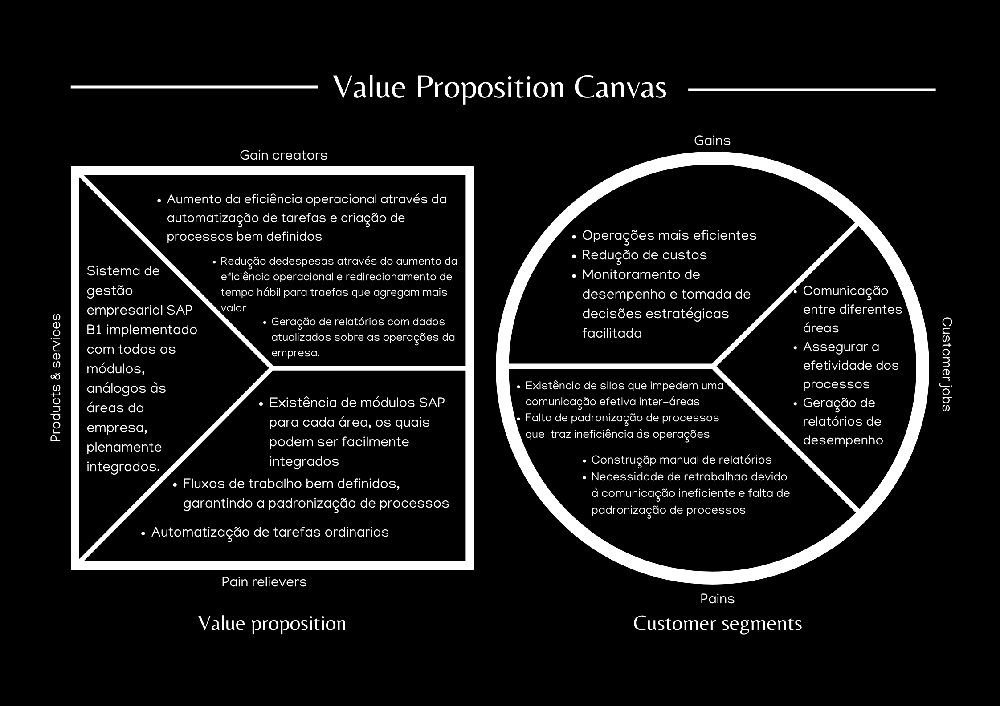

# 1. Documento Principal do Projeto

## (Sprint 1) Entendimento do Negócio

### Value Proposition Canvas

&emsp;&emsp;O Value Proposition Canvas é um framework desenvolvido pelo Dr. Alexander Osterwalder, também criador do Business Model Canvas. Este instrumento tem como objetivo auxiliar no entendimento do valor que um produto, serviço ou negócio pode oferecer aos clientes. O framework é dividido em dois segmentos: um focado no cliente e outro na proposta de valor. No segmento voltado ao cliente, são identificadas as tarefas que os clientes desejam realizar, bem como suas dores e ganhos esperados. No segmento da proposta de valor, são analisados os benefícios oferecidos pelo produto ou serviço e como eles atendem às necessidades e aliviam as dores dos clientes. Dada a importância dessa ferramenta, apresentamos a seguir uma análise baseada no projeto atual, analisando como a equipe poderá agregar valor para o cliente G2 Tecnologia.

Figura X - Canvas da Propost de Valor

Fonte: Material produzido pelos autores (2024)

&emsp;&emsp;No contexto da análise de perfil do cliente, é essencial compreender as tarefas que enfrentam, suas principais dificuldades e os ganhos que esperam alcançar. Para nossos clientes, garantir uma comunicação eficaz entre diferentes áreas da empresa é fundamental, já que a entrega de valor envolve processos que abrangem todos os setores da organização, tanto direta quanto indiretamente. Além disso, é crucial assegurar a efetividade dos processos e gerar relatórios para auditoria, análise de processos e avaliação de desempenho.

&emsp;&emsp;As dificuldades enfrentadas pelos clientes estão diretamente relacionadas a essas tarefas. Silos de informação criam barreiras à comunicação eficiente entre áreas, a falta de padronização de processos resulta em ineficiências operacionais, e a necessidade de gerar relatórios manualmente consome tempo e aumenta o risco de erros. Outro desafio comum é o retrabalho, causado pela comunicação ineficaz e ausência de processos padronizados.

&emsp;&emsp;Para enfrentar essas dificuldades, os clientes buscam ganhos específicos: operações mais eficientes que reduzam retrabalho e custos, além de uma melhor capacidade de monitorar o desempenho e tomar decisões estratégicas com mais facilidade.

&emsp;&emsp;Nossa proposta de valor é o SAP Business One, um sistema de gestão empresarial que oferece uma solução integrada e abrangente. Com todos os módulos necessários para cobrir as diversas áreas da empresa, o SAP Business One elimina os silos de informação, facilita a comunicação entre setores e garante que todos os processos sejam bem definidos e padronizados. A automação de tarefas ordinárias, como a geração de relatórios e o cálculo de impostos, reduz a necessidade de trabalho manual e retrabalho.

&emsp;&emsp;Com a implementação do SAP Business One, os clientes podem esperar um aumento significativo na eficiência operacional, com menores despesas e mais tempo para se dedicar a tarefas que agregam valor. Além disso, a geração de relatórios com dados atualizados proporciona uma visão clara das operações da empresa, facilitando a tomada de decisões estratégicas.

&emsp;&emsp;Portanto, fica evidente que o SAP Business One aborda diretamente as principais questões enfrentadas pelos clientes. O serviço de implementação oferecido é ideal para o momento atual da empresa, proporcionando um aumento na eficiência operacional, redução de custos e facilidade na tomada de decisões estratégicas.

## (Sprint 1) Entendimento da Experiência do Usuário

-

## Handover Sapex

- 

## Manual de Treinamento Sapex

-

