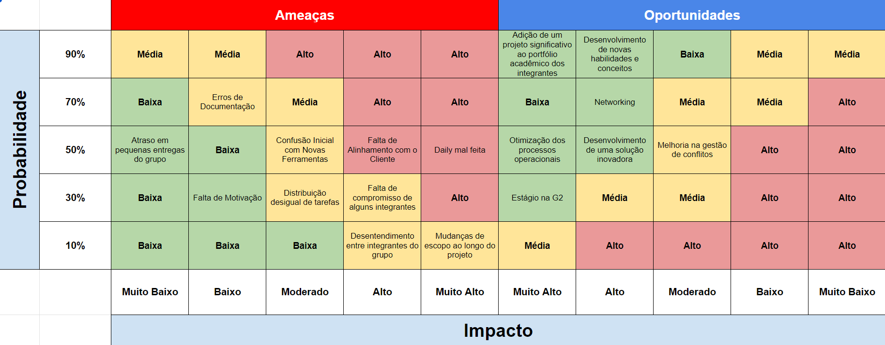
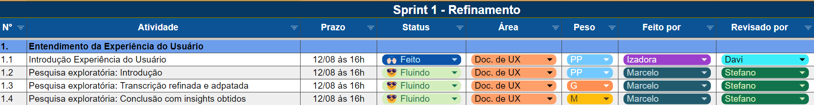

# 1. Entendimento de Negócios 

&emsp;A sessão "Entendimento de Negócios" é projetada para estabelecer uma base no que diz respeito à viabilidade e sustentabilidade do projeto, garantindo que todas as decisões estejam alinhadas com os objetivos estratégicos e operacionais. Esta sessão abrange a análise de riscos e a definição da proposta de valor.

&emsp;O primeiro componente desta sessão é a Matriz de Risco, que deve ser desenvolvida levando em consideração o projeto específico para a empresa *G2 Tecnologia*, com uma visão interna da equipe de aplicação de *SAP*. Este processo envolve a identificação de, 10 riscos potenciais que possam impactar o andamento ou o sucesso do projeto, desenhando ainda um plano de resposta para cada risco identificado e justifique as decisões tomadas, conforme recomendado por Smith (2018), que enfatiza a importância de uma gestão de riscos proativa na garantia da continuidade do negócio. Além disso, o grupo optou por fazer também a Matriz de Oportunidades, identificado 10 oportunidades, que procuram visualizar o melhor cenário possível e estabelecer estratégias para alcançar tais objetivos. 

&emsp;O segundo componente é o Canvas Proposta de Valor, que deve ser elaborado com base na solução que a equipe está desenvolvendo. Este documento articula o valor que a solução proposta traz para o cliente, a G2 tecnologia, considerando suas necessidades e problemas. Estudos como o de Osterwalder et al. (2014) sublinham a eficácia do Canvas Proposta de Valor em alinhar a oferta de valor da solução com as expectativas do mercado, facilitando a comunicação e a implementação de estratégias centradas no cliente.

## 1.1 Matriz de Risco

### Introdução:

Figura 1 - Matriz de risco

Fonte: Material produzido pelos autores (2024)

### Descrição da Matriz:

### Plano de Ação:

&emsp;A sub-seção de Plano de Ação pretende analisar os riscos descritos na seção Matriz de Risco e, a partir disso, estabelecer estratégias para mitigar o acontecimento dos riscos mapeados. Segue a metodologia estabelecida pela equipe:

1. **Erros de Documentação** 
   - Mitigação: Implementar uma revisão duplamente reforçada para garantir que nada seja negligenciado, prevenindo erros. Dessa forma, cada task terá um responsável por executá-la e um responsável por revisá-la.

   Para exemplificar, segue o refinamento realizado na Sprint 1 (sugeito a mudanças nas demais sprints), note os campos de "Feito por" e "Revisado Por", que simboliza o responsável por realizar e revisar cada tarefa:

    

    Figura 2 - Exemplo de parte do Refinamento Criado pela Equipe
    
    Fonte: Material produzido pelos autores (2024)
    

2. **Atraso em Pequenas Entregas do Grupo**
   - Mitigação: O *Scrum Master* e *Product Owner* será responsável verificando se as entregas estão acontecendo dentro do prazo e garantindo que as entregas sejam feitas no prazo a cada Sprint.

3. **Confusão Inicial com Novas Ferramentas**
   - Mitigação: Determinar quais serão as ferramentas utilizadas e exigir que todos os membros do grupo estude-as para estarem alinhados e preparados para o projeto.

4. **Falta de Alinhamento com o Cliente**
   - Mitigação: Confirmar após cada reunião com o cliente que o projeto está no caminho certo e que todos estão alinhados.

5. **Daily Ineficiente**
   - Mitigação: A equipe ágil deve garantir que cada membro saia da daily com clareza sobre o que cada membro do grupo está fazendo, assegurando transparência no desenvolvimento diário.

6. **Falta de Motivação**
   - Mitigação: Se houver sinais de falta de engajamento, focar em atividades de desenvolvimento em grupo para reanimar a equipe.

7. **Distribuição Desigual de Tarefas**
   - Mitigação: Analisar e ajustar a distribuição de tarefas para garantir equilíbrio, como descrito anteriormente.

8. **Falta de Compromisso de Alguns Integrantes**
   - Mitigação: Definir prazos de entrega claros e cumprir rigorosamente conforme estabelecido na planning, comunicando impedimentos.

9. **Desentendimento entre Integrantes do Grupo** 
   - Mitigação: Promover comunicação aberta e resolver conflitos rapidamente, como mencionado anteriormente.

10. **Mudanças de Escopo ao Longo do Projeto** 
    - Mitigação: Analisar as mudanças cuidadosamente, designar quem melhor se encaixa para a tarefa e garantir que o trabalho seja concluído dentro do prazo.

# 2. Experiência de Usuário 
A sessão "Experiência de Usuário" visa detalhar o processo de entendimento das interações e percepções dos usuários em relação ao produto ou serviço em desenvolvimento. A análise da experiência do usuário (UX) garante que o produto final atenda às necessidades e expectativas do público-alvo, sendo um fator crítico para o sucesso do projeto.

Nessa seção, o grupo terá dois focos específicos: Uma pesquisa exploratória e a pesquisa desk. A pesquisa exploratória visa adquirir um entendimento inicial sobre o tema em questão, o que foi obtido por meio de observações em campo e pelo primeiro contato com o parceiro durante o Kick-off, que se deu no dia 7 (sete) de agosto de 2024. Este tipo de pesquisa é fundamental para construir uma base sólida para as etapas subsequentes, conforme discutido por Brown (2019), que destaca a importância de uma fase exploratória robusta para a criação de produtos centrados no usuário.

A pesquisa desk, por sua vez, requer a coleta de dados secundários a partir de fontes confiáveis, como livros, periódicos, publicações oficiais e relatórios de institutos reconhecidos. O objetivo dessa etapa é complementar os dados obtidos na pesquisa exploratória e fornecer uma visão abrangente do contexto do projeto. A eficácia da pesquisa desk está amplamente documentada na literatura, como aponta o estudo de Kumar (2020), que enfatiza a importância de utilizar múltiplas fontes secundárias para enriquecer o entendimento sobre o tema. Os temas escolhidos pela equipe para conduzir a pesquisa desk estão alinhados com o objetivos do módulo em questão, ou seja, o módulo SAP e como funciona a área de estoques, área de foco do grupo em questão.